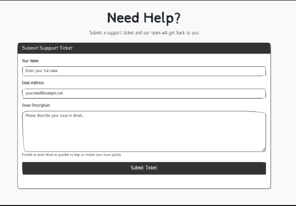
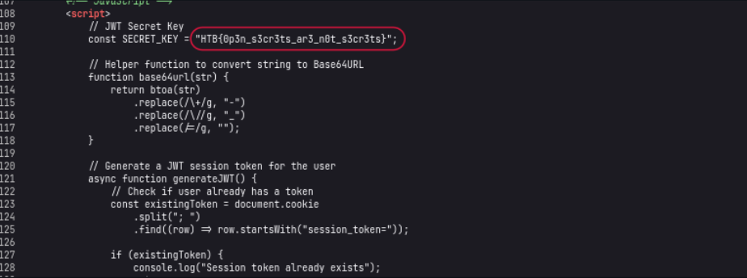
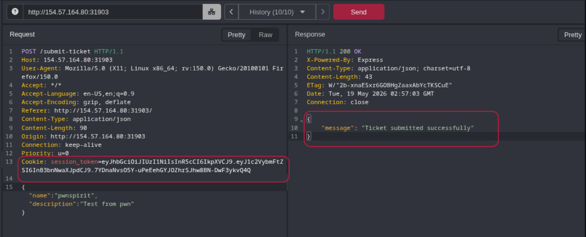
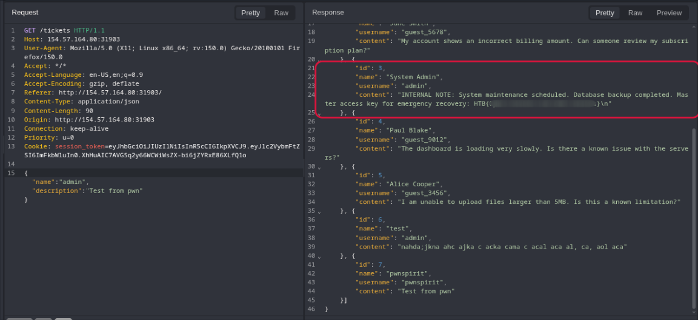

# `OpenSecret`

## Target Host

```
154.57.164.80:31903
```

## Challenge Scenario

A simple help desk portal where users can submit support tickets. The application uses JWT tokens for session management, but something seems off about how they're implemented. Can you find the security flaw?

## Recon

The target webpage is a simple ticket submit system where we can put name, query and submit it.



I just make a test randomly, but it says, `No session token provided`.

Let's look over the source code. I found a JWT SECRET_KEY hidden in the client side, source code.



## Pivot

Now, we got the JWT SECRET_KEY. Let's create a token from `jwt.io` and use it to create a ticket.
```jq
{
  "alg": "HS256",
  "typ": "JWT"
}
---
{
  "username": "admin" //Else we get, Access denied. Admin privileges required.
}
```



## ` /tickets`.



---


