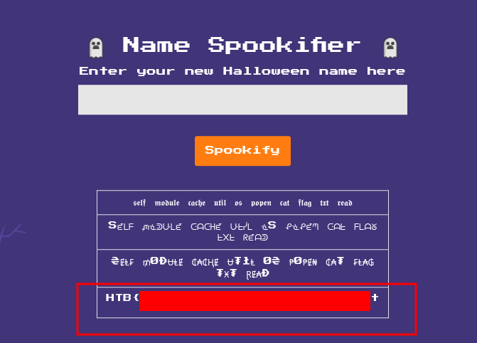

# Spookifier - HackTheBox Writeup

## Challenge Overview
Spookifier is a web challenge that takes user input and "spookifies" it into four different decorative fonts.

## Vulnerability: Server-Side Template Injection (SSTI)
The application is vulnerable to SSTI because it dynamically generates a Mako template string using un-sanitized user input.

### Technical Analysis
In `challenge/application/util.py`, the `spookify` function processes user input through four font mappings. While the first three fonts map characters to stylized Unicode, `font4` is a passthrough for most characters, including `${`, `}`, and `.`.

The resulting "spookified" strings are then passed to `generate_render`:

```python
def generate_render(converted_fonts):
	result = '''
		<tr>
			<td>{0}</td>
        </tr>
        ...
	'''.format(*converted_fonts)
	
	return Template(result).render()
```

The `{0}` through `{3}` placeholders are replaced with the user's input. Because the resulting `result` string is passed directly into `mako.template.Template`, Mako treats any `${...}` syntax in the input as a template expression to be executed.

### Exploitation
Since the environment is Python and uses the Mako engine, we can leverage accessible objects in the template context to execute code. The `self.module.cache.util.os` object provides access to the `os` module.

**Payload:**
```text
${self.module.cache.util.os.popen('cat /flag.txt').read()}
```

When submitted via the `text` parameter, the application renders the output of the `cat /flag.txt` command in the fourth table row.

## Flag
The content of `/flag.txt` is revealed in the rendered output.



<hr>
